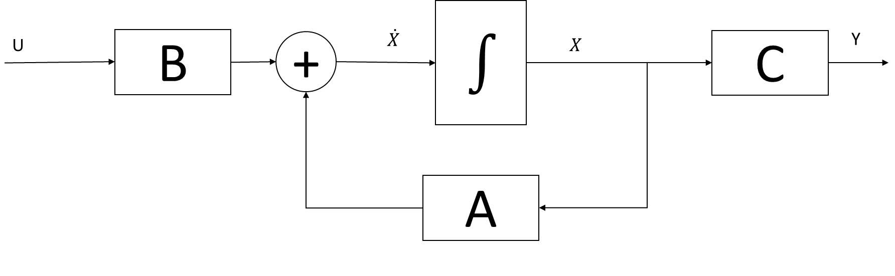
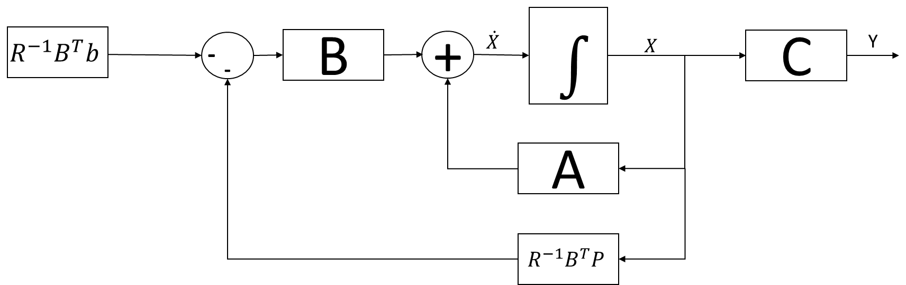

***Juan Pablo Requez***

***juanrequez@gmail.com***

***jprequez@ucla.edu.ve***

***jrequez@unexpo.edu.ve***

Existen dos tipos de controladores de seguimiento: los seguidores y los
servomecanismos (*tracking systems and servomechanisms*). Cuando se
conoce previamente los valores deseados de una salida, se dice que el
problema es uno de seguimiento o tracking. Cuando se desea que la salida
siga a un modelo dado como una ecuación diferencial, se dice que el
problema es de servomecanismo. La diferencia es sutil: si se conoce el
modelo dado como una ecuación diferencial, entonces puede resolverse
para hallar el conjunto de valores deseados de la salida, y cuando se
conoce la salida deseada esta puede acomodarse de forma que obedezca a
una ecuación diferencial. Como siempre, *el diablo está en los
detalles*. A veces, se desea que la planta se comporte como un modelo en
espacio de estados, es decir, se desea que la planta se comporte
diferente a su comportamiento natural, esto corresponde a un
servomecanismo (o también llamado *servo*). Por ejemplo, el modelo que
se desea que siga puede venir de otra planta, también en linea, pero
digamos en un laboratorio con condiciones controladas. A veces, por
ejemplo, en los problemas de aeronáutica o astronáutica, el modelo
prefijado viene de descripciones cuyas soluciones son difíciles de
obtener y es preferible poseer en forma de ecuaciones diferenciales, por
lo que el acercamiento debe ser el de servomecanismo. En otros casos, la
salida deseada es un polinomio o una señal de procesos estándar, como un
escalón o una rampa, y en este caso el acercamiento adecuado es el de
seguimiento.

*Nos concentraremos en el problema de seguimiento*. El único motivo para
tal cosa es que en la producción industrial el *set point* o valor de
referencia nunca es una curva compleja, sino una señal estándar como un
escalón o una rampa. Inclusive, en los problemas eléctricos donde se
desea que el sistema se comporte como una onda sinusoidal
preespecificada, es común conocerla completamente en función de su
frecuencia, amplitud y fase. El problema de servomecanismo no es de
nuestro interés, pero es aplicable a la robótica y a la navegación,
entre otros.

La distinción no es sencilla, por supuesto, y no siempre todos los
autores coinciden en esta definición. Por ejemplo, (Smith & Corripio,
2000) usa solo dos clasificaciones: reguladores (diseñados para
compensar perturbaciones) y servocontroladores (diseñados para ajustarse
al punto de control). A este respecto, (Anderson & Moore, 1989), por
ejemplo, usa la clasificación de reguladores (*regulators*) y
servomecanismos (*servomechanisms*) e indica que los seguidores
(*trackers*) son un tipo de servomecanismo. A pesar de las diferencias
que presenten los diferentes autores, la idea es clara: regular no es lo
mismo que seguir. No profundizaremos más en este análisis, pero es
importante desde el punto de vista teórico reconocer que existen dos
problemas diferentes (por lo menos) y que estos están asociados a dos
índices de desempeño diferentes.

Los resultados que se presentan a continuación están basados en el
análisis mostrado en (Anderson & Moore, 1989). Como siempre, la
demostración de estos resultados se omitirá, pero puede ser consultada
en esta fuente y en miles disponibles en internet.

# Seguimiento lineal cuadrático de horizonte finito

Considérese el sistema lineal (invariante en el tiempo)

+-------------------------------------------------------------------+---+
| $$\dot{x} = Ax + Bu$$                                             | \ |
|                                                                   | ( |
| $$y = Cx$$                                                        | 1 |
|                                                                   | \ |
|                                                                   | ) |
+===================================================================+===+
+-------------------------------------------------------------------+---+

con condición inicial conocida, $x(t_{0})$, y con las matrices
$A \in R^{n \times n},\ B \in R^{n \times m},\ C \in R^{p \times n}$.
Este sistema se dice que está representado en *espacio de estados*, y un
diagrama de bloques para él se muestra en la Figura 1.

{width="6.658883420822397in"
height="2.0566043307086614in"}

Figura 1. Diagrama de bloques del sistema lineal en espacio de estados

y supongamos que se poseen valores deseados de la salida *y*, llamados
$y_{des}$.

Ahora considérese el funcional de desempeño

  ---------------------------------------------------------------------------------------------------------------
  $$J = \frac{1}{2}\int_{t_{0}}^{t_{f}}{u^{T}Ru + \left( y - y_{des} \right)^{T}Q_{2}(y - y_{des})}dt$$   \(2\)
  ------------------------------------------------------------------------------------------------------- -------

  ---------------------------------------------------------------------------------------------------------------

En donde se supone que R es definida positiva y $Q_{2}$ es semidefinida
positiva.

Véase que **el funcional (2) no está escrito en función de los estados,
sino de las salidas**. En este problema, lo que se desea es que la
diferencia entre el *valor deseado de y* y *el valor actual de y* sea lo
menor posible.

Para estos valores deseados de la salida, se pueden calcular los valores
deseados de los estados como

  ---------------------------------------------------------------------------
  $$x_{des} = Ly_{des}$$                                              \(3\)
  ------------------------------------------------------------------- -------

  ---------------------------------------------------------------------------

donde

  ---------------------------------------------------------------------------
  $$L = C^{T}\left( C\ C^{T} \right)^{- 1}$$                          \(4\)
  ------------------------------------------------------------------- -------

  ---------------------------------------------------------------------------

Usando la ecuación (3), el funcional (2) puede escribirse como

  -----------------------------------------------------------------------------------------------------------
  $$J = \frac{1}{2}\int_{t_{0}}^{t_{f}}{u^{T}Ru + \left( x - x_{des} \right)^{T}Q(x - x_{des})}dt$$   \(5\)
  --------------------------------------------------------------------------------------------------- -------

  -----------------------------------------------------------------------------------------------------------

En donde se supone que R es definida positiva y Q es semidefinida
positiva. Existe una relación entre $Q_{2}$ y *Q* dada por

  ---------------------------------------------------------------------------
  $$Q = C^{T}Q_{2}C$$                                                 \(6\)
  ------------------------------------------------------------------- -------

  ---------------------------------------------------------------------------

Lo anterior lo que busca es expresar el funcional descrito en función de
las salidas (2) como un funcional expresado en función de los estados
(5).

El problema anterior se conoce como problema de *seguimiento lineal
cuadrático (LQT, Linear Quadratic Tracking)* debido a que el objetivo
del sistema de control es el seguimiento de una señal de referencia. El
problema anterior tiene una solución dada por

  ---------------------------------------------------------------------------
  $$u = - R^{- 1}B^{T}(P(t)x + b(t))$$                                \(7\)
  ------------------------------------------------------------------- -------

  ---------------------------------------------------------------------------

donde P es la solución de la ecuación matricial diferencial de Riccati

  --------------------------------------------------------------------------------------------------------------------------------------------
  $$\frac{dP}{dt} = - \left( PA + A^{T}P - PBR^{- 1}B^{T}P + Q \right),\ \ \ \ \ \ \ \ \ \ \ \ \ \ \ \ \ P\left( t_{f} \right) = 0$$   \(8\)
  ------------------------------------------------------------------------------------------------------------------------------------ -------

  --------------------------------------------------------------------------------------------------------------------------------------------

y *b* es la solución de la ecuación diferencial vectorial

  --------------------------------------------------------------------------------------------------------------------------------------------
  $$- \frac{db}{dt} = \left( A - BR^{- 1}B^{T}P \right)^{T}b - QLy_{des},\ \ \ \ \ \ \ \ \ \ \ \ \ \ \ \ b\left( t_{f} \right) = 0$$   \(9\)
  ------------------------------------------------------------------------------------------------------------------------------------ -------

  --------------------------------------------------------------------------------------------------------------------------------------------

Luego, la solución requiere resolver hacia atrás dos ecuaciones
diferenciales matriciales para componer la entrada u. Estas ecuaciones
deben resolverse desde $t_{f}$ hasta $t_{0}$ para hallar las soluciones
deseadas. Como la ecuación (9) requiere la solución de la ecuación (8),
primero debe ser resuelta esta para poder hallar *b*. Como se puede
observar, una de las ecuaciones requeridas es la solución de la ecuación
de Ricatti y es simplemente un problema LQR como el que hemos estudiado
previamente, con $Q = C^{T}Q_{2}C$, mientras que la segunda ecuación
diferencial no depende de x ni su aporte a la solución total depende de
x. Esta última solución corresponde a un controlador de adelanto, ya que
no requiere conocer a los estados ni la salida en ningún momento, pero
sí requiere conocer a los valores deseados de y.

{width="6.869891732283465in"
height="2.1666666666666665in"}

Figura 2. Diagrama de bloques en lazo cerrado LQT

Véase la Figura 2. Véase que el bloque indicado por $R^{- 1}B^{T}b$ es
una entrada que solo depende de los valores deseados $y_{des}$ y por lo
tanto es una entrada de adelanto o feedforward. No pierdas de vista que
la salida del controlador de realimentación y el de adelanto ambos
reciben signo negativo, por lo tanto se suman (con signo negativo). Lo
anterior se resume en la Tabla 1.

Convenientemente, no utilizaremos en esta asignatura esta solución en
tiempo finito. Nos concentraremos en la solución en tiempo infinito.

Tabla 1. Resumen LQT -- Horizonte finito LTI

+------------------------+---------------------------------------------+
| Solución del problema  |                                             |
| LQT -- Horizonte       |                                             |
| Finito                 |                                             |
+========================+=============================================+
| Modelo de la planta    | $\frac{dx}{dt} = Ax + Bu$                   |
|                        |                                             |
|                        | $$y = Cx$$                                  |
+------------------------+---------------------------------------------+
| Valores deseados de    | $$x_{des} = Ly_{des}$$                      |
| *y* y *x*              |                                             |
|                        | $$L = C^{T}\left( CC^{T} \right)^{- 1}$$    |
+------------------------+---------------------------------------------+
| Índice de desempeño    | $$J = \frac{1}{                             |
|                        | 2}\int_{t_{0}}^{t_{f}}{u^{T}Ru + \left( y - |
|                        |  y_{des} \right)^{T}Q_{2}(y - y_{des})}dt$$ |
|                        |                                             |
|                        | que se puede escribir como                  |
|                        |                                             |
|                        | $$J = \frac                                 |
|                        | {1}{2}\int_{t_{0}}^{t_{f}}{u^{T}Ru + \left( |
|                        |  x - x_{des} \right)^{T}Q(x - x_{des})}dt$$ |
|                        |                                             |
|                        | $$Q = C^{T}Q_{2}C$$                         |
+------------------------+---------------------------------------------+
| Condiciones iniciales  | $$\ \ x\left( t_{0} \right) = x_{0}$$       |
|                        |                                             |
| (conocidas)            |                                             |
+------------------------+---------------------------------------------+
| Tiempo final           | $$t_{f}$$                                   |
|                        |                                             |
| (conocido)             |                                             |
+------------------------+---------------------------------------------+
| Ecuación diferencial   | $$\frac{dP}{dt                              |
| de Riccati             | } = - (PA + A^{T}P - PBR^{- 1}B^{T}P + Q)$$ |
|                        |                                             |
|                        | $$P\left( t_{f} \right) = 0$$               |
+------------------------+---------------------------------------------+
| Ecuación de            | $$- \frac{db}{dt} = \left( A                |
| Feedforward            | - BR^{- 1}B^{T}P \right)^{T}b - QLy_{des}$$ |
|                        |                                             |
|                        | $$b\left( t_{f} \right) = 0$$               |
+------------------------+---------------------------------------------+
| Ganancia de            | $$K = R^{- 1}B^{T}P(t)$$                    |
| realimentación         |                                             |
+------------------------+---------------------------------------------+
| Entrada de adelanto    | $$K_{ff} = R^{- 1}B^{T}b(t)$$               |
+------------------------+---------------------------------------------+
| Ecuación de control    | $$u(t) = - Kx(t) - K_{ff}$$                 |
+------------------------+---------------------------------------------+

# Seguimiento Lineal Cuadrático de horizonte infinito

La solución del problema de horizonte infinito requiere suponer que el
límite de integración del problema anterior tiende a infinito. Esto
simplifica considerablemente el cálculo. En particular, la ecuación
diferencial de Riccati se convierte en una ecuación algebraica, P se
hace constante, pero *b* no se hace constante (ya que $y_{des}$ no
necesariamente es constante y depende del tiempo). En el caso que
$y_{des}$ sea una función constante (como un escalón), entonces puede
calcularse b como

  ----------------------------------------------------------------------------
  $$b = \left( (A - BK)^{T} \right)^{- 1}QLy_{des}$$                  \(10\)
  ------------------------------------------------------------------- --------

  ----------------------------------------------------------------------------

Que también es constante. Si $y_{des}$ varia lentamente, la solución
(10) también es válida. Luego, la solución del problema de seguimiento
lineal cuadrático está descrito por el índice de desempeño

  -----------------------------------------------------------------------------------------------------------------
  $$J = \frac{1}{2}\int_{t_{0}}^{\infty}{u^{T}Ru + \left( y - y_{des} \right)^{T}Q_{2}(y - y_{des})}dt$$   \(11\)
  -------------------------------------------------------------------------------------------------------- --------

  -----------------------------------------------------------------------------------------------------------------

la referencia o señal deseada:

  ----------------------------------------------------------------------------
  $$x_{des} = Ly_{des}$$                                              \(12\)
  ------------------------------------------------------------------- --------

  ----------------------------------------------------------------------------

donde

  ----------------------------------------------------------------------------
  $$L = C^{T}\left( C\ C^{T} \right)^{- 1}$$                          \(13\)
  ------------------------------------------------------------------- --------
  $$Q = C^{T}Q_{2}C$$                                                 \(14\)

  ----------------------------------------------------------------------------

Y la señal de control está dada por

  ----------------------------------------------------------------------------
  $$u = - R^{- 1}B^{T}(Px + b)$$                                      \(15\)
  ------------------------------------------------------------------- --------

  ----------------------------------------------------------------------------

y P es la solución de la ecuación algebraica de Riccati

  ----------------------------------------------------------------------------
  $$0 = PA + A^{T}P - PBR^{- 1}B^{T}P + Q$$                           \(16\)
  ------------------------------------------------------------------- --------

  ----------------------------------------------------------------------------

y *b* puede calcularse como

  ----------------------------------------------------------------------------
  $$b = \left( (A - BK)^{T} \right)^{- 1}QLy_{des}$$                  \(17\)
  ------------------------------------------------------------------- --------

  ----------------------------------------------------------------------------

Con lo anterior, puede sustituirse (17) en (15) y queda claro que

  --------------------------------------------------------------------------------------------
  $$u = - R^{- 1}B^{T}Px - R^{- 1}B^{T}\left( (A - BK)^{T} \right)^{- 1}QLy_{des}$$   \(18\)
  ----------------------------------------------------------------------------------- --------

  --------------------------------------------------------------------------------------------

y esto puede escribirse como una ganancia de realimentación y una de
adelanto

  ----------------------------------------------------------------------------
  $$u = - Kx - K_{ff}y_{des}$$                                        \(19\)
  ------------------------------------------------------------------- --------

  ----------------------------------------------------------------------------

En donde

  ----------------------------------------------------------------------------
  $$K = R^{- 1}B^{T}P$$                                               \(20\)
  ------------------------------------------------------------------- --------

  ----------------------------------------------------------------------------

y

  ----------------------------------------------------------------------------
  $$K_{ff} = R^{- 1}B^{T}\left( (A - BK)^{T} \right)^{- 1}QL$$        \(21\)
  ------------------------------------------------------------------- --------

  ----------------------------------------------------------------------------

En esta solución, el único problema es el cálculo de P ya que proviene
de la ecuación algebraica de Riccati, que hemos comentado que es una
ecuación matricial no lineal. Sin embargo, es muy sencillo de
implementarse en el software especializado. Una vez calculada la
solución, todos los términos involucrados son constantes.

Puede observarse que no se suministra, como en las semanas anteriores,
la ecuación de estados ni una fórmula para calcular el costo óptimo. La
ecuación de estados puede escribirse, solo que es un poco más complicada
que los casos anteriores. Para obtenerla, sustituya u(t) en la ecuación
de estados por la ecuación de control, y sustituya luego $K_{ff}$ y K.
Respecto al costo óptimo, en realidad no es óptimo. Es infinito (en la
mayoría de los casos). Esto se demuestra en (Anderson & Moore, 1989),
por lo que uno no debe referirse a la solución del problema LQT de
horizonte infinito como "control óptimo". Véase que el problema viene de
la forma que toma b y el impacto que esto tiene en el índice. No puede
garantizarse que se eliminará el error de estado estacionario y por lo
tanto no siempre el índice de desempeño será finito. En el caso de
horizonte finito, la solución presentada sí es optima ya que el
funcional está acotado en los límites de integración. A pesar de que es
incorrecto hablar de esta solución como control óptimo, seguiremos
usando este nombre, reconociendo que es una convención que usamos para
hablar de una solución de un problema obtenido de la extensión de uno de
control óptimo verdadero.

Lo interesante del problema es que, aunque el índice no es minimizado,
la solución es estable (ya que el problema LQR asociado, el de
realimentación sí es óptimo) y una ganancia de adelanto, como estudiamos
previamente en *estrategias de control avanzado de operaciones
unitarias* no afecta la estabilidad de un lazo. Luego, los estados
siguen una trayectoria estable en este problema.

Tabla 2. Resumen LQR -- Horizonte infinito LTI

+------------------------+---------------------------------------------+
| Solución del problema  |                                             |
| LQT -- Horizonte       |                                             |
| infinito               |                                             |
+========================+=============================================+
| Modelo de la planta    | $\frac{dx}{dt} = Ax + Bu$                   |
|                        |                                             |
|                        | $$y = Cx$$                                  |
|                        |                                             |
|                        | (A,B) controlable                           |
+------------------------+---------------------------------------------+
| Valores deseados de    | $$x_{des} = Ly_{des}$$                      |
| *y* y *x*              |                                             |
|                        | $$L = C^{T}\left( CC^{T} \right)^{- 1}$$    |
+------------------------+---------------------------------------------+
| Índice de desempeño    | $$J = \frac{1}{2                            |
|                        | }\int_{t_{0}}^{\infty}{u^{T}Ru + \left( y - |
|                        |  y_{des} \right)^{T}Q_{2}(y - y_{des})}dt$$ |
|                        |                                             |
|                        | que se puede escribir como                  |
|                        |                                             |
|                        | $$J = \frac{                                |
|                        | 1}{2}\int_{t_{0}}^{\infty}{u^{T}Ru + \left( |
|                        |  x - x_{des} \right)^{T}Q(x - x_{des})}dt$$ |
|                        |                                             |
|                        | $$Q = C^{T}Q_{2}C$$                         |
+------------------------+---------------------------------------------+
| Condiciones iniciales  | $$\ \ x\left( t_{0} \right) = x_{0}$$       |
| (conocidas)            |                                             |
+------------------------+---------------------------------------------+
| Tiempo final           | $$\infty$$                                  |
| (conocido)             |                                             |
+------------------------+---------------------------------------------+
| Ecuación Algebraica de | $$0 = PA + A^{T}P - PBR^{- 1}B^{T}P + Q$$   |
| Riccati                |                                             |
+------------------------+---------------------------------------------+
| Ganancia de            | $$K = R^{- 1}B^{T}P$$                       |
| realimentación         |                                             |
+------------------------+---------------------------------------------+
| Ganancia de adelanto   | $$K_{ff} = {R^{- 1}                         |
|                        | B^{T}\left( (A - BK)^{T} \right)}^{- 1}QL$$ |
+------------------------+---------------------------------------------+
| Ecuación de control    | $$u(t) = - Kx(t) - K_{ff}y_{des}$$          |
+------------------------+---------------------------------------------+

Por último, es importante recordar las dimensiones involucradas en los
elementos de este problema LQT de tiempo infinito. Esto se muestra en la
Tabla 3

Tabla 3. Dimensiones de las matrices involucradas en el problema LQT

  -----------------------------------------------------------------------
  Matriz/Vector                           Dimensión
  --------------------------------------- -------------------------------
  A                                       $$n \times n$$

  B                                       $$n \times m$$

  C                                       $$p \times n$$

  $$Q_{2}$$                               $$p \times p$$

  L                                       $$n \times p$$

  Q                                       $$n \times n$$

  R                                       $$m \times m$$

  P                                       $$n \times n$$

  b                                       $$n \times p$$

  $$K$$                                   $$m \times n$$

  $$K_{ff}$$                              $$m \times p$$

  x                                       $$n \times 1$$

  y                                       $$p \times 1$$

  u                                       $$m \times 1$$
  -----------------------------------------------------------------------

### Ejemplo 1. Problema de seguimiento lineal cuadrático

Obtenga el controlador LQT adecuado para

$$A = \begin{bmatrix}
0 & 1 \\
 - 2 & - 3 \\
\end{bmatrix}$$

$$B = \begin{bmatrix}
0 \\
1 \\
\end{bmatrix}$$

$$C = \begin{bmatrix}
1 & 0 \\
\end{bmatrix}$$

según el índice

$$J = \frac{1}{2}\int_{t_{0}}^{\infty}{u^{T}0.04u + \left( y - y_{des} \right)^{T}2(y - y_{des})}dt$$

donde$y_{des}$ es un escalón unitario. Suponga que las condiciones
iniciales son 0.1 para cada estado. (Naidu, 2003)

**Solución:**

Usando Matlab tenemos que

A=\[0 1;-2 -3\]

B=\[0;1\]

C=\[1 0\]

R=0.004

Q2=2

L=C\'/(C\*C\')

Q=C\'\*Q2\*C

\[K,P,E\]=lqr(A,B,Q,R)

b=((A-B\*K)\')\\Q\*L

Kff=R\\B'\*b

Lo que da como resultados

A =

0 1

-2 -3

B =

0

1

C =

1 0

R =

0.0040

Q2 =

2

L =

1

0

Q =

2 0

0 0

K =

20.4499 4.0640

P =

0.6103 0.0818

0.0818 0.0163

E =

-3.5320 + 3.1583i

-3.5320 - 3.1583i

b =

-0.6293

-0.0891

Kff =

-22.2718

En la Figura 3 se presenta el diagrama de bloques de la implementación
del controlador de realimentación del vector de estados junto al
controlador de adelanto requerido para este problema de seguimiento.

{width="7.3180555555555555in"
height="3.526814304461942in"}

Figura 3. Diagrama de bloques del ejemplo 1

También se presentan las respuestas de la salida, los estados y la
entrada en la Figura 4, Figura 5 y Figura 6 respectivamente. Véase que
la salida alcanza el valor de 1 (aproximadamente) para el problema como
el descrito. La salida corresponde al estado 1, por lo tanto, en la
evolución de los estados, el estado 1 alcanza también este valor. El
estado 2 regresa a cero ya que no forma parte de las salidas. Pudo haber
alcanzado otro valor. La entrada, en definitiva, no vale 0 en el estado
estacionario, ya que es necesario mantener una entrada diferente a cero
para que el sistema funcione en otro punto de operación.

{width="4.727227690288714in"
height="3.543307086614173in"}

Figura 4. Salida en lazo cerrado del ejemplo 1

{width="4.727228783902012in"
height="3.543307086614173in"}

Figura 5. Evolución de los estados del ejemplo 1

{width="4.727228783902012in"
height="3.543307086614173in"}

Figura 6. Evolución de la entrada del ejemplo 1

Seguramente hace falta un procedimiento para describir como hacer este
cálculo. En este punto, el procedimiento puede ser propuesto por ti.

# Resumen

Hemos visto como resolver el problema de seguimiento de una señal de
referencia que varíe lentamente o sea constante para un problema de
horizonte infinito, y la solución general para un problema de
seguimiento de horizonte finito, que es válida para cualquier problema
de control en general.

El procedimiento presentado aquí no contempla agregar nuevos estados al
problema, sino trabajar con un controlador de adelanto (que se obtiene
directamente de la formulación del problema). Existen otros
acercamientos posibles para este mismo problema como la inserción de una
acción integral. Este procedimiento fue estudiado en otras asignaturas y
aunque es muy poderoso, no conduce a un resultado tan elegante como el
presentado aquí. En libros de sistemas de control (como por ejemplo
(Ogata, 2002) ) se presenta un acercamiento para el diseño de sistemas
de control de realimentación en donde se incluye una acción integral al
lazo, se amplia el sistema y se redefinen las matrices de estado del
problema. Estas matrices redefinidas pueden usarse para el diseño de
controladores como el descrito aquí, que no conduce a un controlador de
adelanto.

# Referencias

Anderson, B. D., & Moore, J. B. (1989). *Optimal Control - Linear
Quadratic Methods.* Englewood Cliffs, NJ: Prentice-Hall, Inc.

Naidu, D. S. (2003). *Optimal Control Systems.* Boca Raton: CRC Press
LLC.

Ogata, K. (2002). *Modern Control Engineering.* Upper Saddle River:
Prentice - Hall, Inc.

Smith, C. A., & Corripio, A. B. (2000). *Control Automático de
Procesos - Teoría y práctica.* México: Editorial Limusa, S.A de C.V.
